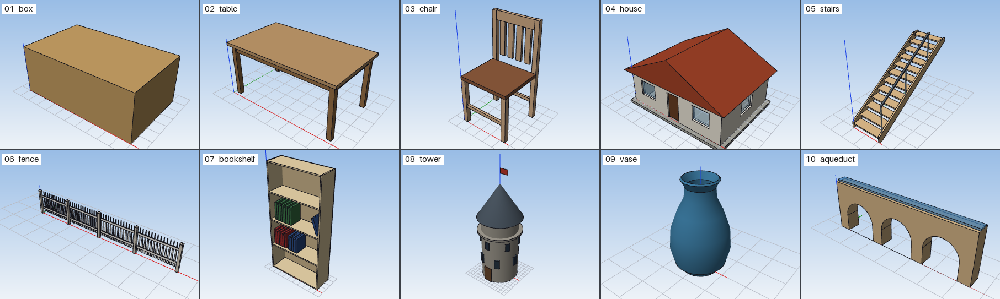
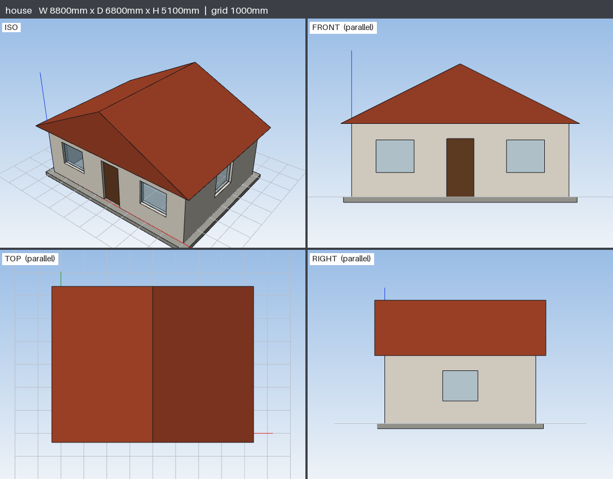
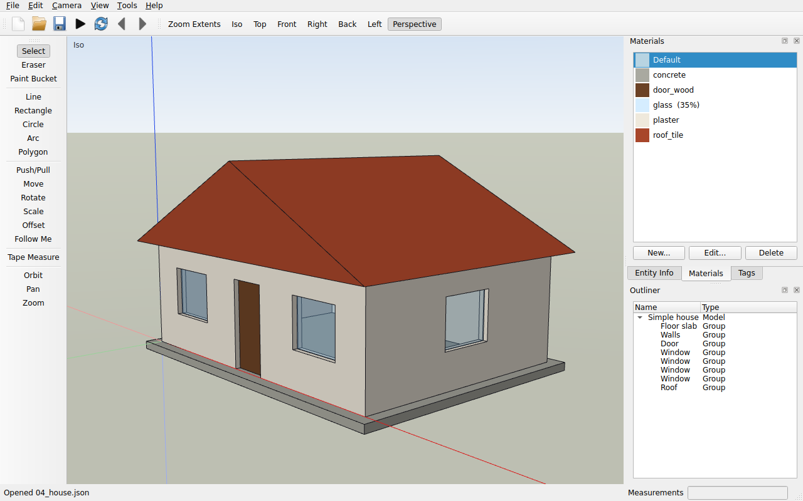
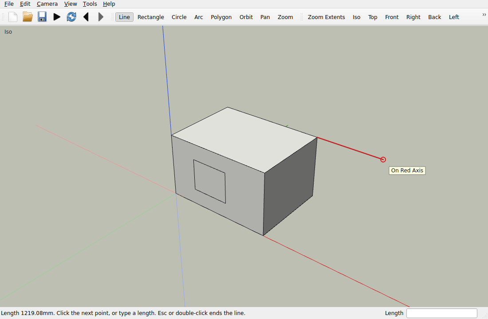
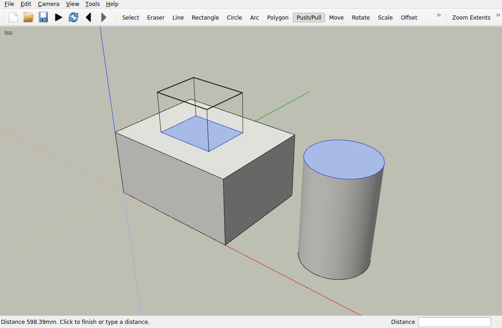

# PyModeler

A SketchUp-style 3D modeler written entirely in Python, built so models can also be created
from **JSON build scripts**. An AI assistant like Claude (or you) writes a JSON file,
PyModeler builds it, renders preview images, and you iterate.



> **Status: Phases 1-5 of 7 complete.** These all work:
> - the SketchUp-style geometry kernel;
> - the complete build-script pipeline: JSON scripts, validation, the CLI, export to OBJ/STL/glTF/GLB,
>   `.pym` save/load and headless PNG previews;
> - the desktop app, with a 3D viewport, navigation, standard views, open/save and Run Build Script;
> - drawing tools with inference snapping, the Measurements box, and undo/redo;
> - editing tools: select, push/pull, move/copy/array, rotate, scale, offset and eraser.
>
> Next come groups, components, materials, tags and the outliner and entity-info panels
> (see [PLAN.md](PLAN.md)).

## Install

Requires Python 3.11+.

```bash
git clone https://github.com/swc0de/3D-CAD-Application.git
cd 3D-CAD-Application
pip install -e ".[dev]"        # or: pip install -r requirements.txt
```

On Linux the GUI and the OpenGL preview renderer need the system libraries
`libegl1 libgl1 libxkbcommon0` (`sudo apt install libegl1 libgl1 libxkbcommon0`). Without
them, previews automatically fall back to a pure-numpy software renderer, so
`--preview` works on any machine, including headless servers.

## Quick start

```bash
python -m pymodeler build examples/04_house.json \
    -o out/house.pym --export out/house.glb --preview out/house.png --report
```

This builds the model, saves it, exports a GLB, and writes `out/house.png` (below) plus one PNG per
view. `--report` prints every named object's bounding box as JSON.



## The app

```bash
python -m pymodeler                     # start the app
python -m pymodeler examples/04_house.json   # (or: python -m pymodeler gui <file>) open a model or script
```



| Action | How |
| --- | --- |
| Orbit | Middle-drag, or the Orbit tool (**O**) with left-drag |
| Pan | Shift + middle-drag, or the Pan tool (**H**) |
| Zoom | Scroll wheel (zooms toward the cursor), or the Zoom tool (**Z**) with drag |
| Zoom extents | **Shift+Z** |
| Re-centre on a point | Double-click the middle button |
| Standard views | Iso **F8**, Top **F2**, Front **F3**, Right **F4**, Back **F5**, Left **F6**, Bottom **F7** |
| Perspective / parallel | **F10** |
| Run a build script | File > Run Build Script (**Ctrl+R**). **F9** rebuilds it after you (or Claude) edit the file. |
| Open / Save / Export | **Ctrl+O** / **Ctrl+S** / **Ctrl+E**. File > Open Recent lists recent files. |

The app opens `.pym` models, imports `.obj` files and builds `.json` scripts. Build errors are
shown in a dialog naming the failing step, and the current model is kept.

### Drawing



| Tool | Key | Use |
| --- | --- | --- |
| Line | **L** | Click points; lines chain until you press Esc, double-click, or close a face. |
| Rectangle | **R** | Click two opposite corners. Draws on the face under the cursor, or on the ground. |
| Circle | **C** | Click the centre, then the radius. |
| Arc | **A** | Click the start, the end, then pull out the bulge (2-point arc). |
| Polygon | — | Click the centre, then the radius. The default is 6 sides. |

- **Inference snapping** works like SketchUp's. The cursor snaps to endpoints (green), midpoints
  (cyan), the origin, points on edges (red) and points on faces (blue). From the previous point
  it also locks to the red, green or blue axis, or runs parallel or perpendicular (magenta) to the
  last edge you hovered. A tooltip names the snap.
- **Locks**: the arrow keys lock a direction (→ red, ← green, ↑ blue; press again to unlock), and
  holding **Shift** keeps the current inference. For Rectangle and Circle, the arrows choose the
  drawing plane instead.
- **Measurements box**: just start typing and press Enter.
  - Line: a length (`2500`, `2.5m`, `8' 6"`), absolute coordinates `[x, y, z]`, or a relative
    offset `<dx, dy, dz>`.
  - Rectangle: `width,depth`.
  - Circle and Polygon: a radius, or `32s` for 32 segments or sides.
  - Arc: the bulge, or a segment count.
- **Undo / Redo**: **Ctrl+Z** and **Ctrl+Y** (or **Ctrl+Shift+Z**). Every tool action is one undo step.

### Editing



| Tool | Key | Use |
| --- | --- | --- |
| Select | **Space** | Click selects; Shift toggles, Ctrl adds, Ctrl+Shift removes. Drag right for a window selection, left for a crossing selection. Double-click selects a face with its edges; triple-click selects everything connected. Clicking a group selects the whole group. |
| Eraser | **E** | Click or drag over edges and groups. Shift hides instead, Ctrl softens. |
| Push/Pull | **P** | Click a face, move, click (or drag). Type a distance. Ctrl keeps the original face; double-click repeats the last distance. |
| Move | **M** | Click a point, then the destination; Ctrl copies. After a copy, type `5x` for five in a row or `/5` to divide the gap. |
| Rotate | **Q** | Click the centre, a reference point, then the angle. The protractor snaps every 15°, and you can type an angle. Arrow keys pick the axis. |
| Scale | **S** | Click a fixed point and a handle, then move. Type `2` or `1.5,1,1`. |
| Offset | **F** | Click a face, then move in or out. Type a distance (positive is inward). |

- **Edit menu**: Delete (**Del**), Select All (**Ctrl+A**), Select None (**Ctrl+T**).
- With nothing selected, Move, Rotate and Scale act on whatever you click.

## Build scripts

A build script is an ordered list of modeling steps. Each step calls one operation, the same
operations the app's tools use.

```json
{
  "version": 1,
  "units": "mm",
  "variables": { "w": 4000, "d": 3000, "h": 2400 },
  "materials": { "brick": "#a0522d", "glass": { "color": "#88ccff", "opacity": 0.4 } },
  "steps": [
    { "op": "rectangle", "id": "room", "width": "$w", "depth": "$d" },
    { "op": "push_pull", "target": "room", "face": "top", "distance": "$h" },
    { "op": "make_group", "target": "room", "name": "Room" },
    { "op": "opening", "target": "Room", "face": "front", "origin": [1500, 0, 0],
      "width": 900, "height": 2100, "depth": "through" },
    { "op": "paint", "target": "Room", "material": "brick" },
    { "op": "component", "id": "post", "steps": [
        { "op": "cylinder", "radius": 50, "height": 1000, "group": false } ] },
    { "op": "place", "component": "post", "position": [0, -1000, 0],
      "repeat": { "count": 5, "offset": [1000, 0, 0] } }
  ]
}
```

Highlights:

- **33 operations**:
  - Drawing: `line`, `rectangle`, `circle`, `arc`, `polygon`, `face`.
  - Modifying faces: `push_pull`, `follow_me`, `offset`, `extrude`, `opening`.
  - Moving and copying: `move`, `rotate`, `scale`, `mirror`, `copy`, `array`.
  - Organising: `group`, `make_group`, `component`, `make_component`, `place`, `explode`, `paint`,
    `set_tag`, `hide`.
  - Editing: `erase`, `intersect`.
  - Variables: `set`.
  - Primitives: `box`, `cylinder`, `cone`, `sphere`.
- **Units** at file level (`mm`, `cm`, `m`, `in`, `ft`) and per value (`"2.4m"`, `"300mm"`,
  `"8' 6\""`).
- **Variables and expressions**: `"$w / 2 - 300mm"`, with functions, comparisons and conditions.
- **Geometry queries**: `"@table.zmax"` reads an earlier object's bounding box, which makes stacking easy.
- **Named references** that survive edits: a rectangle's id names the whole solid after `push_pull`,
  and names the group after `make_group`.
- **Face selectors**: `"top"`, `"front"`, `"-x"`, `{"normal": [...]}`, `{"near": [...]}`, and more.
- **`repeat`** with `count`, `offset`, polar `rotate` or a list of `values`. Each iteration gets
  `$i`, and `id[n]` addresses one copy.
- **Validation** against a JSON Schema
  ([schema/build_script.schema.json](schema/build_script.schema.json)) plus static checks. Errors
  name the step, for example `step 4 (push_pull): missing required parameter 'distance'`.
  A bad file never crashes anything.

Read [CLAUDE.md](CLAUDE.md) for the workflow, patterns and common mistakes, and
[docs/BUILD_SCRIPT_REFERENCE.md](docs/BUILD_SCRIPT_REFERENCE.md) for every operation and
parameter. The [examples/](examples) folder has ten scripts: a box, a table, a chair, a house with
door and window openings, stairs, a fence, a bookshelf built from components, a round tower with a
cone roof, a lathed vase and an arched aqueduct.

## Command line

| Command | What it does |
| --- | --- |
| `python -m pymodeler [file]` | Launch the app (optionally opening a `.pym`, `.obj` or `.json`). |
| `python -m pymodeler build script.json [-o model.pym] [--export f.glb] [--preview p.png] [--report]` | Build a script; save, export, preview, report. |
| `python -m pymodeler validate script.json ...` | Check scripts without building them. |
| `python -m pymodeler render model.pym --preview p.png [--views iso,front] [--size 1200x900]` | Preview a `.pym`, `.obj` or `.json`. |
| `python -m pymodeler export model.pym out.stl out.obj` | Convert between formats. |
| `python -m pymodeler info model.pym` | Print sizes, materials and named objects. |
| `python -m pymodeler ops` | List every operation and its parameters. |
| `python -m pymodeler docs [--check]` | Regenerate the schema, the reference docs and CLAUDE.md's ops list. |

Exports:

| Format | Units | Up axis | Notes |
| --- | --- | --- | --- |
| glTF / GLB | metres | Y up | Materials keep their colour and opacity. |
| OBJ + MTL | metres | Y up | |
| STL | millimetres | Z up | Binary STL. |
| `.pym` | — | — | The native format. Stores the full topology plus the build script, so models stay editable. |

`import` of OBJ files goes into one group per object, and coplanar triangles are merged back into faces.

## Using it with Claude

Ask Claude to write a build script, then let it run the loop:

1. Write `scripts/thing.json`.
2. Run `python -m pymodeler validate scripts/thing.json`.
3. Run `python -m pymodeler build scripts/thing.json --preview out/thing.png --report`.
4. Look at the PNG and the report, fix the script, and repeat.

## The geometry kernel

The kernel lives in `pymodeler/core` and has no GUI dependencies. It behaves like SketchUp's
"sticky" geometry:

- Edges split where they cross, touch or overlap.
- A closed loop of coplanar edges becomes a face.
- An edge drawn across a face splits it, and the pieces keep the material.
- A loop drawn inside a face becomes a hole plus an inner face.
- Erasing the edge between two coplanar faces heals them back into one.
- Push/pull follows SketchUp's rules:
  - A lone face becomes a solid.
  - A face of a solid extends it or cuts a pocket.
  - Pushing all the way through cuts a hole.
  - Coplanar results merge.

```python
from pymodeler.core.entities import Entities
from pymodeler.core.analysis import is_closed_manifold, signed_volume
from pymodeler.ops.extrude import push_pull

ents = Entities()
ents.add_polyline([(0, 0, 0), (4000, 0, 0), (4000, 200, 0), (0, 200, 0)], closed=True)
wall = next(iter(ents.faces.values()))
push_pull(ents, wall, 2400)                                   # a 2.4 m wall
door = ents.add_face([(1000, 0, 0), (1900, 0, 0), (1900, 0, 2100), (1000, 0, 2100)])[0]
push_pull(ents, door, -200)                                   # cut the door through it
print(is_closed_manifold(ents), signed_volume(ents) / 1e9)   # True 1.542
```

## Project layout

```
pymodeler/
  core/     geometry kernel: vertices/edges/faces, sticky geometry, groups & components
  ops/      every modeling operation + the op registry shared by scripts and the GUI
  script/   expressions, build-script engine, validation, schema & docs generation
  io/       .pym, OBJ/STL/glTF/GLB export, OBJ import
  render/   camera, scene, numpy software rasterizer, moderngl renderer, previews
  ui/       PySide6 app: main window, OpenGL viewport, navigation, tools
schema/     generated JSON Schema for build scripts
docs/       generated reference + images
examples/   example build scripts
tests/      pytest suite
```

## Development

```bash
python -m pytest               # run the tests (about 460; a few seconds)
xvfb-run -a python -m pytest   # Linux without a display: also exercises the OpenGL viewport
ruff check pymodeler tests     # lint
python -m pymodeler docs       # regenerate the schema/docs after changing an operation
```

## Roadmap

1. ✅ Geometry kernel
2. ✅ JSON build scripts, CLI, exporters, headless previews, examples
3. ✅ Basic GUI: viewport, navigation, open/save, run build script
4. ✅ Drawing tools with inference snapping and the measurements box (plus undo/redo)
5. ✅ Editing tools and undo/redo
6. Groups, components, materials, tags, outliner and entity info
7. Watch-folder live reload, follow-me, intersect faces and tape measure tools, polish
